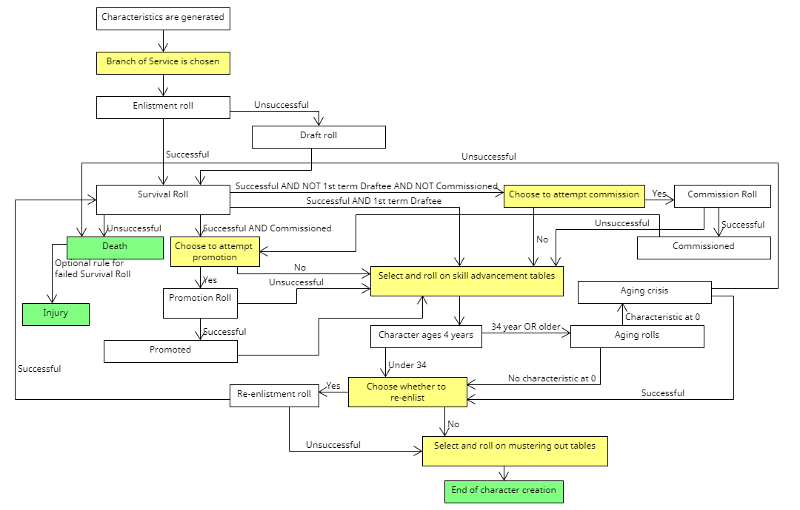
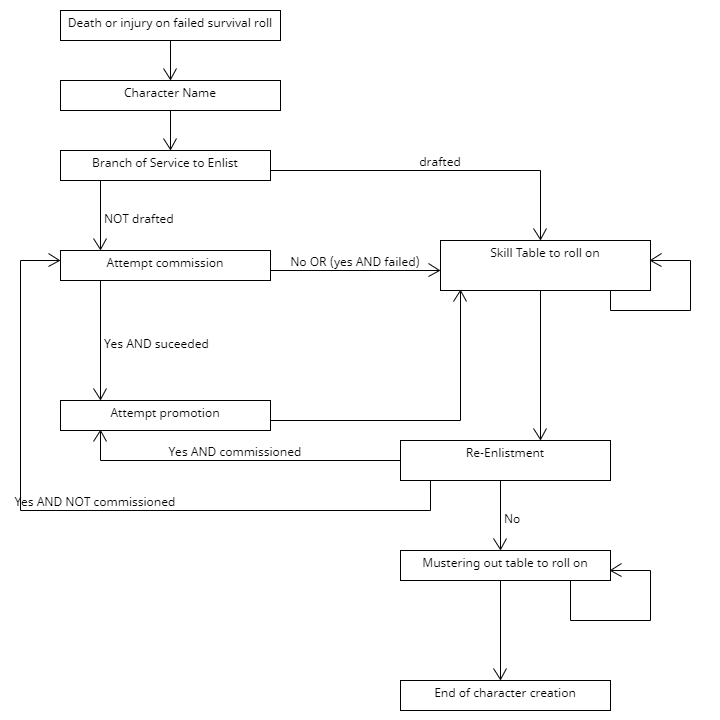
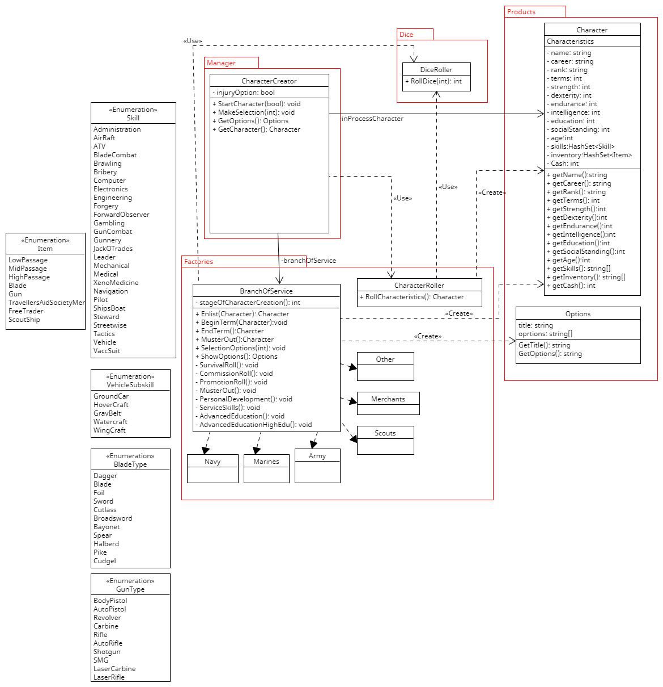

# ClassicTravellerCharacterGenerator
This is a program written in C# to implement the character creation system of the Traveller Role-Playing game. The default character creation system I will be implementing is from the 1981 rules with errata, as found in the "Classic Traveller Fascimile Edition" you can purchase here: 

https://www.drivethrurpg.com/product/355200/Classic-Traveller-Facsimile-Edition?filters=0_0_0_44294_0

Additional character creation options, if those are added later, will be taken from the Traveller supplements in their .pdf form available here:

https://www.drivethrurpg.com/browse/pub/4/Game-Designers039-Workshop-GDW/subcategory/21_4767/Classic-Traveller

# If you aren't familiar with Traveller:
Traveller is one of the earlier pen and paper roleplaying games (RPGs) out there. The first edition was released in 1977, and several subsequent editions have been released to the present year (2022). "Classic Traveller" is referring here to the first edition rules, released in several slightly different versions from 1977 to 1983. What is interesting about these versions of the rules, specifically, is that character creation in "Classic Traveller" is more than just filling out a character sheet. It is a small push-your-luck game in which your character can theoretically die before you start the game. This has the effect of forcing the player to consider if an especially good character should be psuhed through another term, which might improve them or might kill them.

# Character Creation
The character creation process is a series of steps, with a mix of player decisions and randomness. I have included a diagram of the character creation process as a finite state machine below. The yellow boxes indicate decision points for the player. The other boxes represent randomization. Arguably, the decisions to attempt commission or promotion are false choices, because there is no downside to a failed attempt and there are several bonuses on success. On my reading, those are given as choices in the rules, so they will be treated as such in the design.

The green boxes represent the possible endpoints. Typically these are mustering out, in which case the character is ready to be played, or death, in which case you have to start a new character. There is an optional rule in the rulebook that allows a "dead" result to represent an injury. This will be included in the design as an option to be before character creation is started.

After the determination of the Branch of Service by choice or by draft roll, all of the rolls other than aging rolls are made on a Branch of Service specfic table. Whether the character survives, is commissioned, is promoted, the skill advancements obtained, and the mustering out benefits are all based on extremely similar tables for the Branch of Service.

For specifics on how these rolls are made, the relevant tables, etc. I'll refer you to the rulebook linked above.

Because there are numerous choices made during character creation, there will need to be a series of "stopping points" in the process where additional input is taken. I have created a separate diagram showing just the choices made, as each of these will need to be a stopping point for the program. In some cases there will be multiple stops on the roll tables, because the player is allowed to roll more than once.

# Program Structure
This project will be using the Factory and Strategy design patterns in constructing characters. 

The Factory pattern will be used, because the creation of a Character will be handled by an overall CharacterCreator class that will eventually output a Character object without exposing the logic of the construction methods within it. The Character class will be a separate entity with the ability to return desired information about the created character.

The Strategy pattern will be used to handle the Branches of Service. As discussed above, characters all move through the same steps during character creation, but the specific events in each step are based on a different set of possibilites based on the Branch of Service. Having the character creation take place through the same methods, but using the appropriate tables, will ensure that the structure of character creation is maintained across all Branch of Service types, while allowing the differences to be represented.

The flow of the program will be as follows:
The CharacterCreator object will be created with a flag for whether the optional injury rule is in place. It will generate an initial character using the CharacterRoller class. It will then pass the Character delegate further operations to the BranchOfService. The CharacterCreator will handle passing input to the BranchOfService as it goes through the steps of character creation as shown in the finite state machine algorithm shown above, under the heading "Character Creation", with a pause at each decision point for input. When character creation is finished, the CharacterCreator will output a Character object, that will be used as a container for the final characteristics.

BranchOfService is an abstract object that will be instatiated by the specific The BranchOfService object will take in the Character object and, after all necessary decision points have been made, produce a new Character object to replace the prior version and reset so that the character can be input again. It will pause at each decision point and await input, through a SelectOption() method that will take all input and interpret it based on the current choice to be made. It will also have a ShowOptions() selection, so that it will be possible to access the decision being made. This will be in the form of an Options object that can provide information on what the available options are to be used by the display.

At the moment, this does not have View or Controller components. It is only the model right now. 

# UML Diagram

